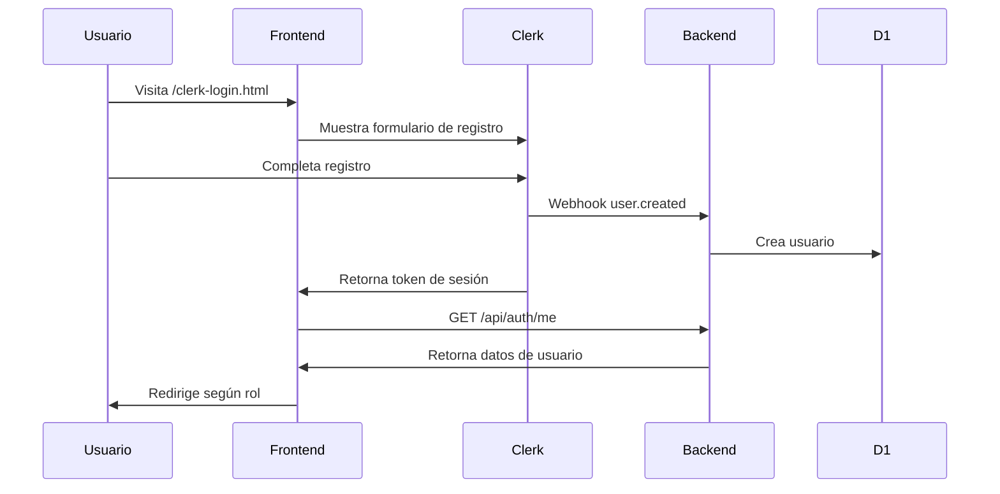
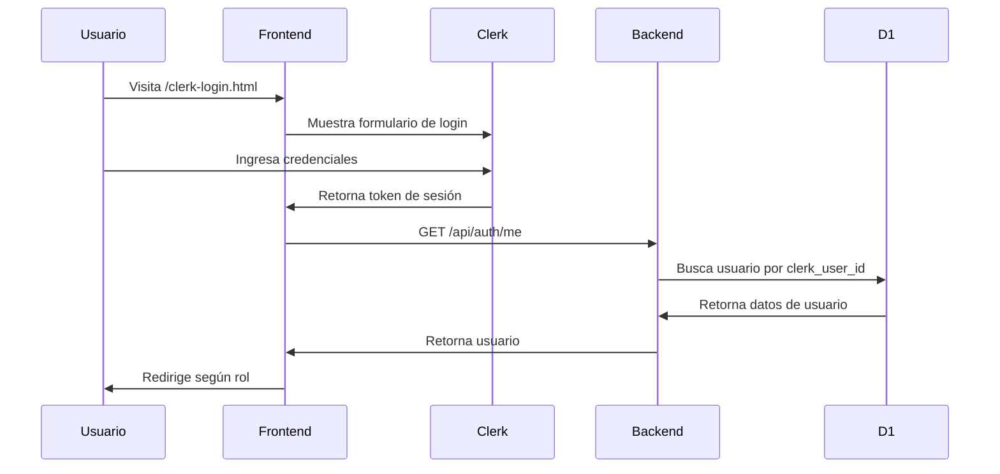

# 🔐 Clerk Authentication Integration

## 🎯 Resumen Ejecutivo

ChispartBuilding ahora soporta autenticación con **Clerk**, proporcionando:

- ✅ Autenticación segura y moderna
- ✅ Gestión de usuarios simplificada
- ✅ Sincronización automática con base de datos
- ✅ Compatibilidad con sistema legacy
- ✅ Webhooks para eventos de usuario

---

## 🚀 Inicio Rápido

### Para Desarrolladores

```bash
# 1. Instalar dependencias (ya hecho)
npm install

# 2. Configurar variables de entorno
cp .env.example .env
# Editar .env y agregar:
# CLERK_PUBLISHABLE_KEY=pk_test_...
# CLERK_SECRET_KEY=sk_test_...

# 3. Aplicar migración de base de datos
npx wrangler d1 execute edificio-admin-db --local --file=migrations/0007_add_clerk_integration.sql

# 4. Iniciar servidor de desarrollo
npm run dev

# 5. Probar integración
npm run test:clerk
```

### Para Usuarios

1. Visita `/clerk-login.html` para la nueva experiencia de login
2. Regístrate o inicia sesión con Clerk
3. Completa tu perfil si eres nuevo usuario
4. ¡Listo! Serás redirigido según tu rol

---

## 📁 Archivos Nuevos

### Backend
```
src/
├── middleware/
│   └── clerk-auth.js              # Middleware de autenticación con Clerk
├── controllers/
│   ├── clerk-auth.controller.js   # Endpoints de autenticación
│   └── clerk-webhook.controller.js # Handler de webhooks
├── routes/
│   ├── clerk-auth.routes.js       # Rutas de autenticación
│   └── clerk-webhook.routes.js    # Rutas de webhooks
└── models/
    └── Usuario.js                 # Métodos actualizados para Clerk
```

### Frontend
```
public/
├── js/
│   └── clerk-auth.js              # SDK de Clerk para frontend
└── clerk-login.html               # Página de login con Clerk
```

### Migración
```
migrations/
└── 0007_add_clerk_integration.sql # Migración de BD
```

### Documentación
```
CLERK_INTEGRATION_GUIDE.md         # Guía completa de integración
CLERK_README.md                    # Este archivo
test-clerk-integration.sh          # Script de pruebas
```

---

## 🔑 Credenciales de Clerk

### Desarrollo
```
Publishable Key: pk_test_cG9saXNoZWQtaGFnZmlzaC01OS5jbGVyay5hY2NvdW50cy5kZXYk
Secret Key: sk_test_xKdQsi3EgzOWa2h8UiF29W8ZWPfE9q51PSElpCBSfK
JWKS URL: https://polished-hagfish-59.clerk.accounts.dev/.well-known/jwks.json
```

### Dashboard
```
URL: https://dashboard.clerk.com
App: polished-hagfish-59
```

---

## 🌐 Endpoints API

### Autenticación con Clerk

#### `GET /api/auth/me`
Obtiene los datos del usuario autenticado con token de Clerk.

**Headers:**
```
Authorization: Bearer <clerk_session_token>
```

**Response (200):**
```json
{
  "ok": true,
  "usuario": {
    "id": 1,
    "clerk_user_id": "user_xxx",
    "nombre": "Juan Pérez",
    "email": "juan@example.com",
    "rol": "ADMIN",
    "departamento": "101",
    "buildingId": 1
  }
}
```

#### `POST /api/auth/clerk-setup`
Completa el setup de un nuevo usuario de Clerk.

**Headers:**
```
Authorization: Bearer <clerk_session_token>
Content-Type: application/json
```

**Body:**
```json
{
  "departamento": "101",
  "telefono": "+56912345678",
  "buildingId": 1,
  "rol": "INQUILINO"
}
```

**Response (201):**
```json
{
  "ok": true,
  "usuario": {
    "id": 2,
    "clerk_user_id": "user_xxx",
    "nombre": "Juan Pérez",
    "email": "juan@example.com",
    "rol": "INQUILINO",
    "departamento": "101"
  }
}
```

### Webhooks

#### `POST /api/webhooks/clerk`
Recibe webhooks de Clerk para sincronización de usuarios.

**Headers (automáticos de Clerk):**
```
svix-id: msg_xxx
svix-timestamp: 1234567890
svix-signature: v1,xxx
Content-Type: application/json
```

**Eventos soportados:**
- `user.created` - Crea usuario en D1
- `user.updated` - Actualiza usuario en D1
- `user.deleted` - Desactiva usuario en D1

#### `GET /api/webhooks/clerk/test`
Endpoint de prueba para verificar que el webhook está activo.

**Response (200):**
```json
{
  "ok": true,
  "msg": "Clerk webhook endpoint is active",
  "timestamp": "2026-01-19T01:00:00.000Z",
  "env": {
    "hasClerkSecret": true,
    "hasWebhookSecret": true,
    "hasDB": true
  }
}
```

---

## 🗄️ Cambios en Base de Datos

### Nuevas Columnas en `usuarios`

```sql
clerk_user_id TEXT UNIQUE          -- ID del usuario en Clerk
created_via_clerk INTEGER DEFAULT 0 -- 1 si fue creado vía Clerk
clerk_metadata TEXT                 -- Metadata de Clerk (JSON)
```

### Índices

```sql
CREATE UNIQUE INDEX idx_usuarios_clerk_id_unique ON usuarios(clerk_user_id) WHERE clerk_user_id IS NOT NULL;
CREATE INDEX idx_usuarios_clerk_id ON usuarios(clerk_user_id);
```

---

## 🔄 Flujo de Datos

### Registro de Nuevo Usuario



### Login de Usuario Existente



---

## 🧪 Testing

### Pruebas Automáticas

```bash
# Ejecutar script de pruebas
./test-clerk-integration.sh
```

### Pruebas Manuales

1. **Test de Login:**
   - Visita `http://localhost:3001/clerk-login.html`
   - Intenta registrarte con un nuevo email
   - Verifica que seas redirigido correctamente

2. **Test de Webhook:**
   - Crea un usuario en Clerk Dashboard
   - Verifica que aparezca en la base de datos
   - Actualiza el usuario en Clerk
   - Verifica que los cambios se reflejen en D1

3. **Test de API:**
   ```bash
   # Obtener token de Clerk (desde el navegador)
   const token = await window.ClerkAuth.getSessionToken();
   console.log(token);
   
   # Usar token para llamar API
   curl -H "Authorization: Bearer <token>" \
        http://localhost:3001/api/auth/me
   ```

---

## 🔧 Configuración de Clerk Dashboard

### 1. Configurar Webhook

1. Ve a [Clerk Dashboard](https://dashboard.clerk.com)
2. Selecciona tu app: **polished-hagfish-59**
3. Ve a **Webhooks** → **Add Endpoint**
4. Configura:
   - **URL**: `https://edificio-admin.sebastianvernis.workers.dev/api/webhooks/clerk`
   - **Eventos**: `user.created`, `user.updated`, `user.deleted`
5. Copia el **Signing Secret**
6. Configura en Cloudflare:
   ```bash
   npx wrangler secret put CLERK_WEBHOOK_SECRET
   ```

### 2. Configurar Metadata

En **User & Authentication** → **Metadata**, agrega:

```json
{
  "rol": "INQUILINO",
  "departamento": "",
  "buildingId": null,
  "telefono": ""
}
```

### 3. Configurar URLs

En **Paths**:
- **Sign-in URL**: `/clerk-login.html`
- **After sign-in**: `/admin.html`
- **After sign-up**: `/setup.html`

---

## 🚀 Despliegue a Producción

### 1. Aplicar Migración

```bash
npx wrangler d1 execute edificio-admin-db --remote --file=migrations/0007_add_clerk_integration.sql
```

### 2. Configurar Secrets

```bash
npx wrangler secret put CLERK_SECRET_KEY
npx wrangler secret put CLERK_WEBHOOK_SECRET
```

### 3. Desplegar Worker

```bash
npm run deploy:workers
```

### 4. Verificar

```bash
curl https://edificio-admin.sebastianvernis.workers.dev/api/webhooks/clerk/test
```

---

## 📚 Recursos

- [Guía Completa de Integración](CLERK_INTEGRATION_GUIDE.md)
- [Clerk Documentation](https://clerk.com/docs)
- [Clerk Dashboard](https://dashboard.clerk.com)
- [Cloudflare Workers Docs](https://developers.cloudflare.com/workers/)

---

## ❓ FAQ

### ¿Puedo seguir usando el login tradicional?

Sí, el sistema legacy sigue funcionando. Los usuarios pueden usar `/login.html` para el login tradicional.

### ¿Qué pasa con los usuarios existentes?

Los usuarios existentes pueden seguir usando el sistema legacy. Si quieren migrar a Clerk, pueden crear una cuenta nueva con el mismo email.

### ¿Cómo migro usuarios existentes a Clerk?

Puedes usar la API de Clerk para crear usuarios programáticamente. Ver documentación en `CLERK_INTEGRATION_GUIDE.md`.

### ¿El webhook es obligatorio?

Sí, el webhook es necesario para sincronizar usuarios entre Clerk y tu base de datos.

### ¿Qué pasa si el webhook falla?

Clerk reintentará automáticamente. Puedes ver los logs en Clerk Dashboard.

---

**Última actualización:** 19 de Enero, 2026  
**Versión:** 1.0.0  
**Autor:** Integración realizada con BLACKBOX.AI
