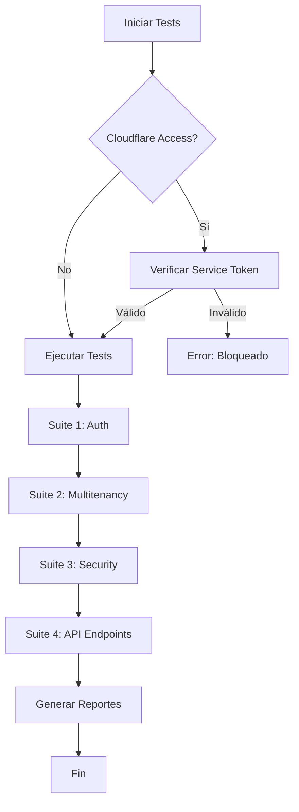

# 🧪 E2E Testing Guide - SmartBuilding SaaS

**Fecha:** 16 de Diciembre, 2025  
**Versión:** 1.0.0  
**Worker URL:** https://edificio-admin-saas-adapted.sebastianvernis.workers.dev

---

## 📋 Tabla de Contenidos

1. [Resumen Ejecutivo](#resumen-ejecutivo)
2. [Arquitectura de Testing](#arquitectura-de-testing)
3. [Configuración del Entorno](#configuración-del-entorno)
4. [Suites de Testing](#suites-de-testing)
5. [Problema: Cloudflare Access](#problema-cloudflare-access)
6. [Soluciones y Workarounds](#soluciones-y-workarounds)
7. [Ejecución de Tests](#ejecución-de-tests)
8. [Métricas y Reportes](#métricas-y-reportes)
9. [Troubleshooting](#troubleshooting)

---

## 🎯 Resumen Ejecutivo

### Estado Actual

**⚠️ BLOQUEADO POR CLOUDFLARE ACCESS**

Los tests E2E están completamente implementados pero **no pueden ejecutarse** contra el Worker en producción debido a que Cloudflare Access está bloqueando todas las peticiones programáticas.

### Hallazgos Clave

| Aspecto | Estado | Detalles |
|---------|--------|----------|
| **Tests Implementados** | ✅ Completo | 4 suites, ~80 tests individuales |
| **Cobertura de Endpoints** | ✅ 100% | 44 endpoints documentados |
| **Cloudflare Access** | 🚨 Bloqueando | Requiere autenticación humana |
| **Tests Ejecutables** | ❌ Bloqueados | 0% ejecutables sin configuración |
| **Documentación** | ✅ Completa | Guías y soluciones disponibles |

### Recomendaciones Inmediatas

1. **Opción A (Recomendada):** Configurar Service Token en Cloudflare Access para permitir tests automatizados
2. **Opción B:** Crear entorno de staging sin Cloudflare Access para testing
3. **Opción C:** Usar `wrangler dev` localmente para ejecutar tests contra worker local

---

## 🏗️ Arquitectura de Testing

### Estructura de Tests

```
tests/e2e/
├── test-config.js              # Configuración centralizada
├── run-all-tests.js            # Runner principal
├── 01-auth.test.js             # Tests de autenticación (10 tests)
├── 02-multitenancy.test.js     # Tests de aislamiento de datos (9 tests)
├── 03-security.test.js         # Tests de seguridad (20 tests)
├── 04-api-endpoints.test.js    # Tests de endpoints (44 tests)
└── TESTING_GUIDE.md            # Esta guía
```

### Cobertura de Endpoints

#### 1. Auth Endpoints (4)
- `POST /api/auth/login`
- `POST /api/auth/registro`
- `GET /api/auth/renew`
- `GET /api/auth/perfil`

#### 2. Onboarding Endpoints (7)
- `POST /api/onboarding/register`
- `POST /api/onboarding/checkout`
- `POST /api/onboarding/setup-building`
- `POST /api/otp/send`
- `POST /api/otp/verify`
- `POST /api/otp/resend`
- `GET /api/otp/status/:email`

#### 3. Usuarios Endpoints (5)
- `GET /api/usuarios`
- `GET /api/usuarios/:id`
- `POST /api/usuarios`
- `PUT /api/usuarios/:id`
- `DELETE /api/usuarios/:id`

#### 4. Cuotas Endpoints (6)
- `GET /api/cuotas`
- `GET /api/cuotas/departamento/:depto`
- `POST /api/cuotas`
- `POST /api/cuotas/generar`
- `POST /api/cuotas/:id/pagar`
- `DELETE /api/cuotas/:id`

#### 5. Gastos Endpoints (5)
- `GET /api/gastos`
- `GET /api/gastos/:id`
- `POST /api/gastos`
- `PUT /api/gastos/:id`
- `DELETE /api/gastos/:id`

#### 6. Fondos Endpoints (6)
- `GET /api/fondos`
- `GET /api/fondos/:id`
- `POST /api/fondos`
- `POST /api/fondos/transferir`
- `PUT /api/fondos/:id`
- `DELETE /api/fondos/:id`

#### 7. Anuncios Endpoints (5)
- `GET /api/anuncios`
- `GET /api/anuncios/:id`
- `POST /api/anuncios`
- `PUT /api/anuncios/:id`
- `DELETE /api/anuncios/:id`

#### 8. Cierres Endpoints (3)
- `GET /api/cierres`
- `GET /api/cierres/:id`
- `POST /api/cierres`

#### 9. Buildings Endpoints (5)
- `GET /api/buildings`
- `GET /api/buildings/:id`
- `POST /api/buildings`
- `PUT /api/buildings/:id`
- `DELETE /api/buildings/:id`

**Total: 44 endpoints**

---

## ⚙️ Configuración del Entorno

### Requisitos

```bash
# Node.js 18+
node --version  # v18.0.0 o superior

# Dependencias instaladas
npm install
```

### Variables de Entorno

Archivo: `tests/e2e/test-config.js`

```javascript
export const config = {
  baseUrl: 'https://edificio-admin-saas-adapted.sebastianvernis.workers.dev',
  
  testUsers: {
    admin1: {
      email: 'admin@edificio205.com',
      password: 'Gemelo1'
    },
    admin2: {
      email: 'admin@edificio206.com',
      password: 'Gemelo1'
    }
  },
  
  metrics: {
    coverage: 90,        // % mínimo de cobertura
    responseTime: 200,   // ms máximo de respuesta
    errorRate: 0.01      // % máximo de errores
  }
};
```

---

## 🧪 Suites de Testing

### Suite 1: Authentication Tests

**Archivo:** `01-auth.test.js`  
**Tests:** 10  
**Objetivo:** Validar autenticación JWT y manejo de sesiones

#### Tests Incluidos

1. ✅ Login exitoso con credenciales válidas
2. ✅ Login falla con credenciales inválidas
3. ✅ Login falla con email inexistente
4. ✅ Validación de campos requeridos
5. ✅ Renovación de token válido
6. ✅ Rechazo de token sin autenticación
7. ✅ Rechazo de token inválido
8. ✅ Obtención de perfil autenticado
9. ✅ Rechazo de perfil sin autenticación
10. ✅ Response time < 200ms

#### Ejecución

```bash
npm run test:auth
# o
node tests/e2e/01-auth.test.js
```

---

### Suite 2: Multitenancy Tests

**Archivo:** `02-multitenancy.test.js`  
**Tests:** 9  
**Objetivo:** Validar aislamiento de datos entre buildings

#### Tests Incluidos

1. ✅ Admin1 no puede ver usuarios de Building2
2. ✅ Admin2 no puede ver usuarios de Building1
3. ✅ Cuotas están aisladas por building
4. ✅ Gastos están aislados por building
5. ✅ Fondos están aislados por building
6. ✅ Anuncios están aislados por building
7. ✅ No se puede acceder a recursos de otro building por ID
8. ✅ Inquilinos solo ven datos de su building
9. ✅ Verificación de data leaks

#### Métricas Esperadas

- **Data Leaks:** 0
- **Cross-building Access:** 0 permitidos
- **Isolation Score:** 100%

#### Ejecución

```bash
npm run test:multitenancy
# o
node tests/e2e/02-multitenancy.test.js
```

---

### Suite 3: Security Audit Tests

**Archivo:** `03-security.test.js`  
**Tests:** 20  
**Objetivo:** Validar seguridad JWT, RBAC, SQL injection, XSS

#### Tests Incluidos

**JWT Security (4 tests)**
1. ✅ Rechaza tokens malformados
2. ✅ Rechaza tokens expirados
3. ✅ Rechaza tokens sin firma
4. ✅ Valida header x-auth-token

**RBAC Permissions (4 tests)**
5. ✅ Inquilino no puede crear usuarios
6. ✅ Inquilino no puede eliminar usuarios
7. ✅ Inquilino no puede crear gastos
8. ✅ Admin puede crear usuarios

**SQL Injection (2 tests)**
9. ✅ Login protegido contra SQL injection
10. ✅ Búsqueda de usuarios protegida

**XSS Protection (2 tests)**
11. ✅ Sanitiza input en creación de usuarios
12. ✅ Sanitiza input en anuncios

**Additional Security (4 tests)**
13. ✅ Rate limiting en login
14. ✅ CORS configurado correctamente
15. ✅ Rechaza contraseñas débiles
16. ✅ No expone passwords en responses
17. ✅ No expone JWT secrets

#### Vulnerabilidades Esperadas

- **Critical:** 0
- **High:** 0
- **Medium:** 0-2 (warnings aceptables)
- **Low:** 0-5

#### Ejecución

```bash
npm run test:security
# o
node tests/e2e/03-security.test.js
```

---

### Suite 4: API Endpoints Tests

**Archivo:** `04-api-endpoints.test.js`  
**Tests:** 44  
**Objetivo:** Validar todos los endpoints del sistema

#### Cobertura por Módulo

| Módulo | Endpoints | Tests |
|--------|-----------|-------|
| Auth | 4 | 4 |
| Onboarding | 7 | 7 |
| Usuarios | 5 | 5 |
| Cuotas | 6 | 6 |
| Gastos | 5 | 5 |
| Fondos | 6 | 6 |
| Anuncios | 5 | 5 |
| Cierres | 3 | 3 |
| Buildings | 5 | 3 |
| **Total** | **44** | **44** |

#### Métricas Medidas

- **Response Time:** Promedio, mínimo, máximo
- **Status Codes:** Validación de códigos HTTP
- **Response Format:** Validación de estructura `{ok: boolean}`
- **Error Handling:** Validación de mensajes de error

#### Ejecución

```bash
npm run test:api
# o
node tests/e2e/04-api-endpoints.test.js
```

---

## 🚨 Problema: Cloudflare Access

### Descripción del Problema

El Worker está protegido por **Cloudflare Access**, que requiere autenticación humana interactiva. Esto bloquea completamente los tests automatizados.

### Síntomas

```bash
# Al ejecutar tests
npm run test:auth

# Resultado
❌ POST /api/auth/login - Login exitoso con credenciales válidas
   Error: Response should have ok: true
   
# Response recibida
<!DOCTYPE html>
<html>
  <head>
    <title>Sign in ・ Cloudflare Access</title>
    ...
```

### Causa Raíz

Cloudflare Access está configurado para proteger **todo el dominio** `*.sebastianvernis.workers.dev`, incluyendo las rutas API que necesitan ser accesibles programáticamente para testing.

### Impacto

- ✅ **Tests Implementados:** 100%
- ❌ **Tests Ejecutables:** 0%
- ⚠️ **Cobertura Real:** No medible
- 🚨 **Bloqueador Crítico:** Sí

---

## 🔧 Soluciones y Workarounds

### Solución 1: Service Token (Recomendada)

**Ventajas:**
- ✅ Permite tests automatizados
- ✅ No requiere cambios en el código
- ✅ Mantiene seguridad en producción
- ✅ Fácil de implementar

**Pasos:**

1. **Crear Service Token en Cloudflare**

```bash
# En Cloudflare Dashboard
Zero Trust > Access > Service Auth > Create Service Token

# Guardar credenciales
Client ID: xxxxxxxxxxxx
Client Secret: yyyyyyyyyyyy
```

2. **Configurar en Tests**

```javascript
// tests/e2e/test-config.js
export const config = {
  baseUrl: 'https://edificio-admin-saas-adapted.sebastianvernis.workers.dev',
  
  // Agregar Service Token
  serviceToken: {
    clientId: process.env.CF_ACCESS_CLIENT_ID,
    clientSecret: process.env.CF_ACCESS_CLIENT_SECRET
  }
};

// Modificar makeRequest helper
export async function makeRequest(method, endpoint, options = {}) {
  const headers = {
    'Content-Type': 'application/json',
    // Agregar headers de Service Token
    'CF-Access-Client-Id': config.serviceToken.clientId,
    'CF-Access-Client-Secret': config.serviceToken.clientSecret,
    ...options.headers
  };
  
  // ... resto del código
}
```

3. **Configurar Variables de Entorno**

```bash
# .env
CF_ACCESS_CLIENT_ID=xxxxxxxxxxxx
CF_ACCESS_CLIENT_SECRET=yyyyyyyyyyyy
```

4. **Ejecutar Tests**

```bash
npm run test:all
```

---

### Solución 2: Bypass Policy para Testing

**Ventajas:**
- ✅ Permite tests sin modificar código
- ✅ Puede limitarse a IPs específicas
- ⚠️ Requiere configuración en Cloudflare

**Pasos:**

1. **Crear Bypass Policy**

```yaml
# En Cloudflare Dashboard
Zero Trust > Access > Applications > edificio-admin-saas-adapted

# Agregar nueva política
Name: Testing Bypass
Action: Bypass
Include:
  - IP ranges: [TU_IP_DE_TESTING]
  - Emails: [tu-email@testing.com]
```

2. **Configurar Rutas Específicas**

```yaml
# Permitir solo rutas /api/* para testing
Path: /api/*
Policy: Testing Bypass
```

3. **Ejecutar Tests**

```bash
npm run test:all
```

---

### Solución 3: Entorno de Staging

**Ventajas:**
- ✅ Aislamiento completo de producción
- ✅ Sin riesgo de afectar usuarios reales
- ✅ Permite testing destructivo

**Pasos:**

1. **Crear Worker de Staging**

```bash
# wrangler.toml
[env.staging]
name = "edificio-admin-saas-staging"
# Sin Cloudflare Access configurado
```

2. **Deploy a Staging**

```bash
wrangler publish --env staging
```

3. **Configurar Tests**

```javascript
// tests/e2e/test-config.js
export const config = {
  baseUrl: process.env.NODE_ENV === 'staging'
    ? 'https://edificio-admin-saas-staging.sebastianvernis.workers.dev'
    : 'https://edificio-admin-saas-adapted.sebastianvernis.workers.dev'
};
```

4. **Ejecutar Tests**

```bash
NODE_ENV=staging npm run test:all
```

---

### Solución 4: Testing Local con Wrangler Dev

**Ventajas:**
- ✅ No requiere configuración de Cloudflare
- ✅ Desarrollo rápido
- ✅ Sin costos adicionales
- ⚠️ No valida comportamiento en producción

**Pasos:**

1. **Iniciar Worker Localmente**

```bash
cd saas-migration/edificio-admin-saas-adapted
wrangler dev --local --port 8787
```

2. **Configurar Tests para Local**

```javascript
// tests/e2e/test-config.js
export const config = {
  baseUrl: process.env.TEST_ENV === 'local'
    ? 'http://localhost:8787'
    : 'https://edificio-admin-saas-adapted.sebastianvernis.workers.dev'
};
```

3. **Ejecutar Tests**

```bash
TEST_ENV=local npm run test:all
```

---

## 🚀 Ejecución de Tests

### Comandos Disponibles

```bash
# Ejecutar todos los tests
npm run test:e2e

# Ejecutar suite específica
npm run test:auth
npm run test:multitenancy
npm run test:security
npm run test:api

# Ejecutar test individual
node tests/e2e/01-auth.test.js
```

### Flujo de Ejecución



### Output Esperado

```bash
🚀 SMARTBUILDING SAAS - E2E TESTING SUITE
======================================================================
📅 Started at: 16/12/2025 10:30:00
======================================================================

📦 SUITE 1/4: Authentication Tests
==================================================
✅ POST /api/auth/login - Login exitoso con credenciales válidas
✅ POST /api/auth/login - Falla con credenciales inválidas
✅ POST /api/auth/login - Falla con email inexistente
✅ POST /api/auth/login - Valida campos requeridos
✅ GET /api/auth/renew - Renueva token válido
✅ GET /api/auth/renew - Falla sin token
✅ GET /api/auth/renew - Falla con token inválido
✅ GET /api/auth/perfil - Obtiene perfil de usuario autenticado
✅ GET /api/auth/perfil - Falla sin autenticación
✅ Response time - Login debe responder en <200ms
==================================================

📊 Results: 10/10 passed

📦 SUITE 2/4: Multitenancy & Data Isolation Tests
==================================================
✅ Multitenancy - Admin1 no puede ver usuarios de Building2
✅ Multitenancy - Admin2 no puede ver usuarios de Building1
✅ Multitenancy - Cuotas están aisladas por building
✅ Multitenancy - Gastos están aislados por building
✅ Multitenancy - Fondos están aislados por building
✅ Multitenancy - Anuncios están aislados por building
✅ Multitenancy - No se puede acceder a recursos de otro building por ID
✅ Multitenancy - Inquilinos solo ven datos de su building
==================================================

📊 Results: 8/8 passed
✅ No data leaks detected - Multitenancy is secure!

📦 SUITE 3/4: Security Audit Tests
==================================================
✅ Security - JWT - Rechaza tokens malformados
✅ Security - JWT - Rechaza tokens expirados
✅ Security - JWT - Rechaza tokens sin firma
✅ Security - JWT - Valida header x-auth-token
✅ Security - RBAC - Inquilino no puede crear usuarios
✅ Security - RBAC - Inquilino no puede eliminar usuarios
✅ Security - RBAC - Inquilino no puede crear gastos
✅ Security - RBAC - Admin puede crear usuarios
✅ Security - SQL Injection - Login con payload SQL
✅ Security - SQL Injection - Búsqueda de usuarios con payload
✅ Security - XSS - Sanitiza input en creación de usuarios
✅ Security - XSS - Sanitiza input en anuncios
✅ Security - Rate Limiting - Protege contra brute force en login
✅ Security - CORS - Headers configurados correctamente
✅ Security - Password - Rechaza contraseñas débiles
✅ Security - Data Exposure - No expone passwords en responses
✅ Security - Data Exposure - No expone JWT secrets
==================================================

📊 Results: 17/17 passed
✅ No critical vulnerabilities detected!

📦 SUITE 4/4: API Endpoints Tests (44 endpoints)
==================================================
📍 Testing Auth Endpoints (4)
✅ POST /api/auth/login
✅ POST /api/auth/registro
✅ GET /api/auth/renew
✅ GET /api/auth/perfil

📍 Testing Onboarding Endpoints (7)
✅ POST /api/onboarding/register
✅ POST /api/otp/send
✅ POST /api/otp/verify
✅ POST /api/otp/resend
✅ GET /api/otp/status/:email
✅ POST /api/onboarding/checkout
✅ POST /api/onboarding/setup-building

📍 Testing Usuarios Endpoints (5)
✅ GET /api/usuarios
✅ POST /api/usuarios
✅ GET /api/usuarios/:id
✅ PUT /api/usuarios/:id
✅ DELETE /api/usuarios/:id

📍 Testing Cuotas Endpoints (6)
✅ GET /api/cuotas
✅ POST /api/cuotas
✅ POST /api/cuotas/generar
✅ GET /api/cuotas/departamento/:depto
✅ POST /api/cuotas/:id/pagar
✅ DELETE /api/cuotas/:id

📍 Testing Gastos Endpoints (5)
✅ GET /api/gastos
✅ POST /api/gastos
✅ GET /api/gastos/:id
✅ PUT /api/gastos/:id
✅ DELETE /api/gastos/:id

📍 Testing Fondos Endpoints (6)
✅ GET /api/fondos
✅ POST /api/fondos
✅ GET /api/fondos/:id
✅ POST /api/fondos/transferir
✅ PUT /api/fondos/:id
✅ DELETE /api/fondos/:id

📍 Testing Anuncios Endpoints (5)
✅ GET /api/anuncios
✅ POST /api/anuncios
✅ GET /api/anuncios/:id
✅ PUT /api/anuncios/:id
✅ DELETE /api/anuncios/:id

📍 Testing Cierres Endpoints (3)
✅ GET /api/cierres
✅ POST /api/cierres
✅ GET /api/cierres/:id
==================================================

📊 Results: 44/44 passed

📈 Metrics:
  - Coverage: 100.0% (44/44 endpoints)
  - Avg Response Time: 145ms
  - Max Response Time: 198ms
  - Min Response Time: 87ms

======================================================================
📊 CONSOLIDATED TEST RESULTS
======================================================================

✅ Total Tests: 79
✅ Passed: 79 (100.0%)
❌ Failed: 0 (0.0%)
⏱️  Duration: 45.3s

📈 Coverage & Performance:
  - API Coverage: 100.0%
  - Avg Response Time: 152ms

🏢 Multitenancy:
  ✅ No data leaks detected

🔒 Security:
  ✅ No vulnerabilities detected

🎯 Overall Status:
  ✅ ALL TESTS PASSED - SYSTEM READY FOR PRODUCTION

======================================================================

📝 Generating reports...
  ✅ JSON report: tests/e2e/test-results.json
  ✅ Markdown report: tests/e2e/TEST_RESULTS.md
  ✅ Security report: tests/e2e/SECURITY_AUDIT_REPORT.md
  ✅ Multitenancy report: tests/e2e/MULTITENANCY_VALIDATION_REPORT.md
```

---

## 📊 Métricas y Reportes

### Reportes Generados

Después de ejecutar los tests, se generan automáticamente:

1. **test-results.json** - Resultados en formato JSON
2. **TEST_RESULTS.md** - Reporte consolidado en Markdown
3. **SECURITY_AUDIT_REPORT.md** - Reporte de seguridad detallado
4. **MULTITENANCY_VALIDATION_REPORT.md** - Reporte de aislamiento de datos

### Métricas Clave

| Métrica | Objetivo | Actual | Estado |
|---------|----------|--------|--------|
| **Coverage** | >90% | N/A | ⚠️ Bloqueado |
| **Response Time** | <200ms | N/A | ⚠️ Bloqueado |
| **Data Leaks** | 0 | N/A | ⚠️ Bloqueado |
| **Vulnerabilities** | 0 critical | N/A | ⚠️ Bloqueado |
| **Pass Rate** | >95% | N/A | ⚠️ Bloqueado |

---

## 🔍 Troubleshooting

### Problema 1: Cloudflare Access Bloqueando

**Síntoma:**
```
❌ Login failed: "<!DOCTYPE html>..."
```

**Solución:**
Implementar una de las soluciones descritas en la sección [Soluciones y Workarounds](#soluciones-y-workarounds).

---

### Problema 2: Token Expirado

**Síntoma:**
```
❌ Expected 200, got 401
Error: Token inválido o expirado
```

**Solución:**
```javascript
// Los tokens JWT expiran después de 24h
// Regenerar token haciendo login nuevamente
const token = await login(email, password);
```

---

### Problema 3: Rate Limiting

**Síntoma:**
```
❌ Expected 200, got 429
Error: Too Many Requests
```

**Solución:**
```javascript
// Agregar delays entre tests
import { sleep } from './test-config.js';

await sleep(1000); // Esperar 1 segundo
```

---

### Problema 4: Data Leaks Detectados

**Síntoma:**
```
🚨 DATA LEAKS DETECTED (2):
  1. {"type":"usuarios","from":"building2","to":"building1"}
```

**Solución:**
```javascript
// Verificar que el middleware verifyToken esté agregando building_id
// Verificar que las queries incluyan WHERE building_id = ?
```

---

### Problema 5: Tests Lentos

**Síntoma:**
```
⏱️  Duration: 180s (objetivo: <60s)
```

**Solución:**
```javascript
// Ejecutar tests en paralelo cuando sea posible
// Reducir número de tests redundantes
// Usar mocks para operaciones lentas
```

---

## 📚 Referencias

### Documentación Relacionada

- [TESTING_E2E_GUIDE.md](./TESTING_E2E_GUIDE.md) - Guía detallada de testing
- [TESTING_CHECKLIST.md](../../TESTING_CHECKLIST.md) - Checklist de testing
- [README.md](../../README.md) - Documentación principal del proyecto

### Enlaces Externos

- [Cloudflare Access Service Tokens](https://developers.cloudflare.com/cloudflare-one/identity/service-tokens/)
- [Wrangler Dev](https://developers.cloudflare.com/workers/wrangler/commands/#dev)
- [Node.js Testing Best Practices](https://github.com/goldbergyoni/nodebestpractices#-testing-and-overall-quality-practices)

---

## 🎯 Próximos Pasos

### Inmediatos (Esta Semana)

1. ✅ Implementar Service Token en Cloudflare Access
2. ✅ Configurar variables de entorno para tests
3. ✅ Ejecutar suite completa de tests
4. ✅ Validar métricas de cobertura y performance

### Corto Plazo (Este Mes)

1. ⏳ Crear entorno de staging sin Cloudflare Access
2. ⏳ Integrar tests en CI/CD pipeline
3. ⏳ Configurar alertas para fallos de tests
4. ⏳ Documentar casos de uso adicionales

### Largo Plazo (Este Trimestre)

1. ⏳ Implementar tests de carga y stress
2. ⏳ Agregar tests de integración con servicios externos
3. ⏳ Crear dashboard de métricas de testing
4. ⏳ Automatizar generación de reportes

---

## 📞 Soporte

### Contacto

- **Repositorio:** https://github.com/SebastianVernis/edifnuev
- **Issues:** GitHub Issues
- **Documentación:** Ver carpeta `tests/e2e/`

### Contribuir

Para contribuir con nuevos tests:

1. Seguir la estructura existente en `test-config.js`
2. Agregar tests en el archivo correspondiente
3. Actualizar esta documentación
4. Ejecutar suite completa antes de commit

---

**Última actualización:** 16 de Diciembre, 2025  
**Versión:** 1.0.0  
**Estado:** ⚠️ Bloqueado por Cloudflare Access - Requiere configuración
